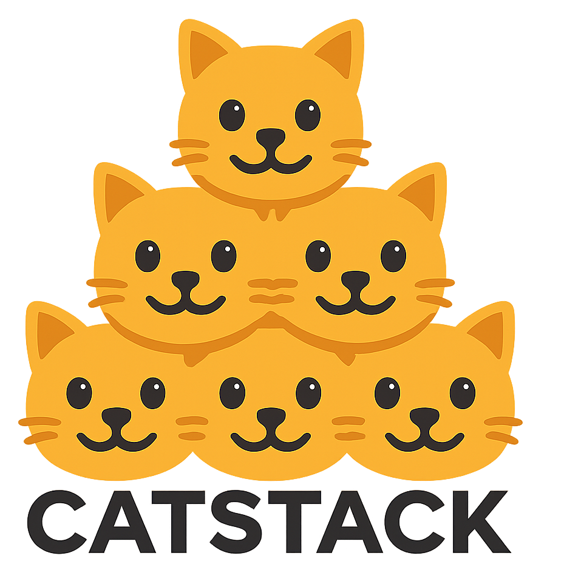

# CatStack

Loosely coupled Terraform framework making complex infrastructure
understandable and scalable.

## Definition of Terms

infra_environments: infra_environments short for infrastructure environments
are the AWS accounts where resources will be created and hosted.

xxx.tfvars.json: This file hosts Terraform variables that are shared between
the domains and stacks.

xxx.tfbackend: This file hosts the details of the Terraform backend
configuration for that specific infrastructure environment.

Domain: Domains are directories which contains the IaC code of the resources
deployed. Domains have numbers infront of them which indicates in which order
of the Stack they are applied. For example, Domains starting with 001 means
that the resources in those domains are the first that should be deployed in an
environment.

Stack: The Stack directory contains the directory of all domains. Think of a
Stack as a kitchen drawer and the contents in that drawer are known as domains.

Module: A module is a group of resources that together provide a certain value
for a domain or stack.

## Domains

A CatStack is a composition of _domains_. A domain is an autonomous Terraform
component with its own seperated Terraform state. You can have low level
domains and higher level domains, E.g. the KMS domain is a low level domain as
it has many dependants, while an EC2 instance domain is high level domain. Like
any other vanilla Terraform project, a CatStack domain can use terraform
modules.

A CatStack domain is not distributed as an installable module, but its
more like glue code for one or more resources to define an infrastruture
component in a larger system or solution. 

### Example Domains

- ...
